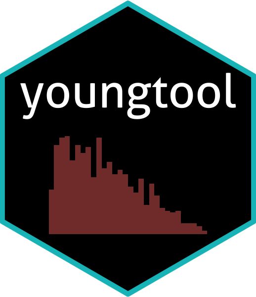
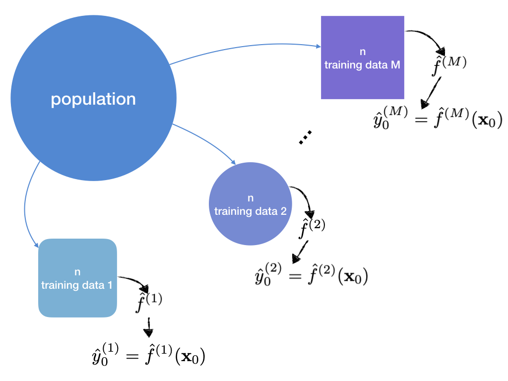

```{r setup, include=FALSE}
knitr::opts_chunk$set(
  comment = "#>",
  collapse = TRUE,
  out.width = "70%",
  fig.align = "center",
  fig.width = 6,
  fig.asp = .618
  )
options(digits = 3)
pander::panderOptions("round", 3)
```

# youngtool <a href='https://github.com/ygeunkim/youngtool'></a>

[](https://travis-ci.org/ygeunkim/youngtool)
[](https://codecov.io/gh/ygeunkim/youngtool?branch=master)

This package has many functions when writing academic works.

## Installation

```{r, eval=FALSE}
# install.packages("devtools")
devtools::install_github("ygeunkim/youngtool")
```


## Monte Carlo Simulation

In simulation study, we can assume population. In other words, we can generate many training data to fit each model.

```{r, echo=FALSE}

```


