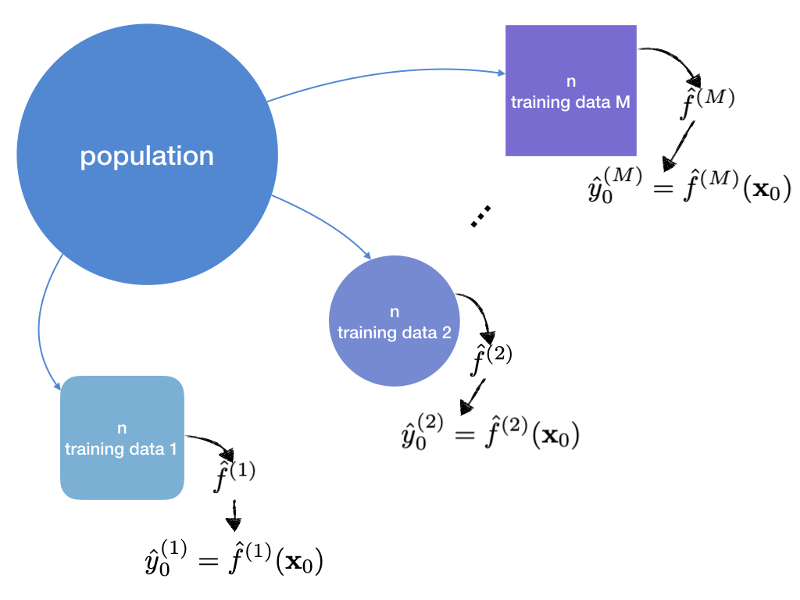

# `youngtool`

[](https://travis-ci.org/user/pkg)

This package has many functions when writing academic works.

## Installation

``` r
# install.packages("devtools")
devtools::install_github("ygeunkim/youngtool")
```

## Monte Carlo Simulation

In simulation study, we can assume population. In other words, we can
generate many training data to fit each model.


